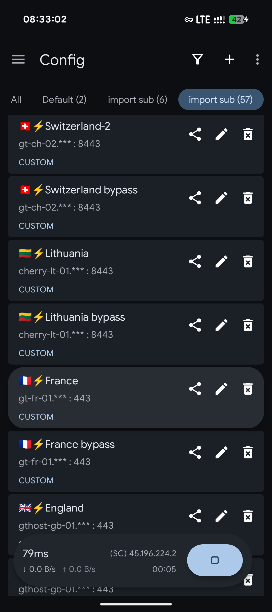
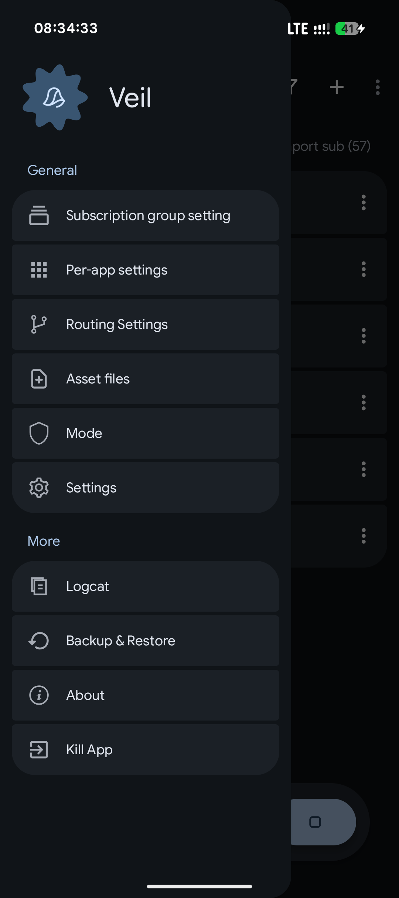
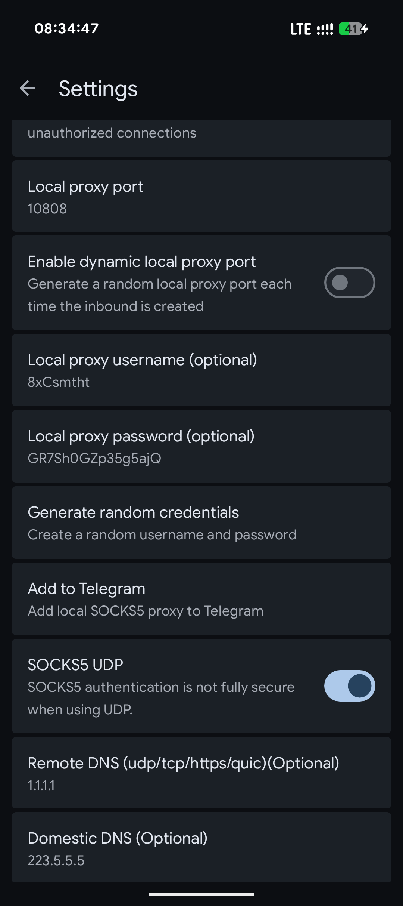
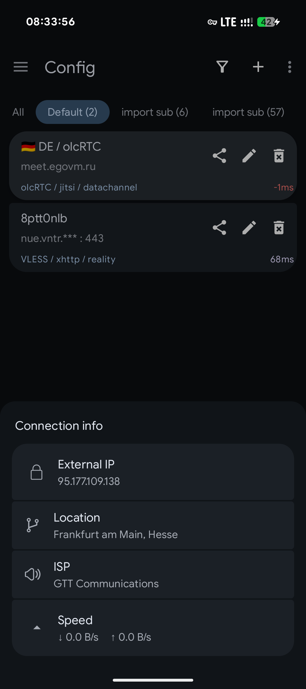

# Veil

A V2Ray / Xray client for Android with Material 3 UI and olcRTC tunnel support.

[](https://developer.android.com/about/versions/nougat)
[](https://kotlinlang.org)
[](LICENSE)

> **Warning:** This project is in early development. Bugs, crashes, and breaking changes are expected. Use at your own risk.

Based on [v2rayNG](https://github.com/2dust/v2rayNG) by 2dust.

## Downloads

Pre-built APKs are available on the [releases page](https://github.com/venterum/veil/releases).

## Documentation

Full documentation (EN/RU) is in the [docs](docs/index.md) directory.

## Features

- Standard protocols: VMess, VLESS, Shadowsocks, Trojan, SOCKS, WireGuard, Hysteria2
- **olcRTC** — encrypted TCP-over-WebRTC tunnel (carriers: Jitsi, Telemost, WbStream; transports: DataChannel, VP8, SEI)
- Subscription management and QR-code import/export
- Per-app proxy, routing rules, DNS, fragmentation, mux and more
- VPN service backed by `hev-socks5-tunnel` or the xray-core tunnel
- **Three connection modes:** VPN (all traffic through tunnel), Proxy (SOCKS5 only, no TUN), Hybrid Mode (SOCKS5 proxy with optional in-app TUN toggle)
- geoip / geosite rule support
- Material 3 UI with Google Sans Flex typeface

## Screenshots

| | | | |
|:---:|:---:|:---:|:---:|
|  |  |  |  |

## Architecture

```text
App traffic
     ↓
VPN / Proxy Android service
     ↓
Xray core (routing, DNS, mux, fragmentation)
     ↓
SOCKS5 → 127.0.0.1:{port}      ← olcRTC profile only; standard protocols go direct
     ↓
olcRTC Go transport (WebRTC → SFU server → remote olcRTC → internet)
```

### Core integration

The Xray core and olcRTC transport are compiled together into a **single `libv2ray.aar`** via gomobile:

| Go module | Package | Role |
|---|---|---|
| `github.com/2dust/AndroidLibXrayLite` | `libv2ray.*` | Xray core (routing, protocols, DNS) |
| `olcrtc/mobile` | `mobile.*` | olcRTC WebRTC transport (SOCKS5 server) |

Both modules are unmodified. They share one process (`:RunSoLibV2RayDaemon`) and communicate via loopback SOCKS5 — Xray's outbound points to `127.0.0.1:{olcrtc_port}` using a standard SOCKS outbound config. No custom patching of either core.

For standard protocols Xray connects directly to the remote server. For olcRTC profiles, Xray routes traffic through the local olcRTC SOCKS5 proxy which tunnels it via WebRTC.

## Project layout

```
.
├── veil/                     # Android application (Gradle project)
│   └── app/
│       ├── src/main/java/com/v2ray/ang/core/OlcrtcManager.kt
│       ├── src/main/java/com/v2ray/ang/fmt/OlcrtcFmt.kt
│       ├── src/main/java/com/v2ray/ang/ui/OlcrtcActivity.kt
│       └── ...
├── olcrtc/                  # git submodule — olcRTC Go transport
├── hev-socks5-tunnel/       # git submodule — native TUN tunnel
├── AndroidLibXrayLite/      # git submodule — Go sources for Xray core bindings
├── compile-hevtun.sh        # builds the native libhev-socks5-tunnel libraries
├── compile-libv2ray.sh      # builds the combined libv2ray.aar (Xray + olcRTC)
└── README.md
```

## Building from source

### Requirements

- JDK 17+
- Android SDK: `platforms;android-37`, `build-tools;37.0.0`, `platform-tools`
- Android NDK for the native tunnel
- Go 1.26+ with gomobile (`go install golang.org/x/mobile/cmd/gomobile@latest && gomobile init`)

### Steps

1. **Clone**

   ```bash
   git clone --recurse-submodules https://github.com/venterum/veil
   ```

2. **Build `hev-socks5-tunnel` native libraries**

   ```bash
   export NDK_HOME=$ANDROID_HOME/ndk/<ndk-version>
   bash compile-hevtun.sh
   cp -r libs veil/app/
   ```

3. **Build the combined `libv2ray.aar`** (Xray core + olcRTC in one AAR)

   ```bash
   export ANDROID_HOME=/path/to/android-sdk
   export ANDROID_NDK_HOME=$ANDROID_HOME/ndk/<ndk-version>
   bash compile-libv2ray.sh
   ```

   The script builds a single `libv2ray.aar` with 16 KB ELF alignment, containing:
   - `libv2ray.*` — standard Xray core bindings from `AndroidLibXrayLite`
   - `mobile.*` — olcRTC Go transport via gomobile
   - `libgojni.so` — native Go binary for all ABIs
   - `geoip.dat`, `geosite.dat` — rule assets

4. **Build the APK**

   ```bash
   echo "sdk.dir=$ANDROID_HOME" > veil/local.properties
   cd veil
   ./gradlew assembleDebug
   ```

   APK outputs: `veil/app/build/outputs/apk/debug/`, split per ABI (`arm64-v8a`, `armeabi-v7a`, `x86`, `x86_64`).

## Backward compatibility with v2rayNG

Since Veil is a fork of [v2rayNG](https://github.com/2dust/v2rayNG) and shares its config format you can migrate seamlessly:

(available since 2.0.x)

1. Open v2rayNG, open the side drawer → **Backup & Restore** → **Backup config** → **Local**
2. Transfer the saved config files to this device
3. Open veil, go to the side drawer → **Backup & Restore** → **Restore config** → **Local**, select the file

Standard protocol profiles (VMess, VLESS, Shadowsocks, Trojan, SOCKS, WireGuard, Hysteria2), subscriptions, and settings are fully compatible. olcRTC-specific profiles only work in veil.

## Credits

- [v2rayNG](https://github.com/2dust/v2rayNG) by 2dust — upstream project
- [Xray-core](https://github.com/XTLS/Xray-core) and [v2fly/v2ray-core](https://github.com/v2fly/v2ray-core)
- [hev-socks5-tunnel](https://github.com/heiher/hev-socks5-tunnel) by heiher
- [olcRTC](https://github.com/openlibrecommunity/olcrtc) by openlibrecommunity
- [Google Sans](https://fonts.google.com/specimen/Google+Sans) and
  [Google Sans Flex](https://fonts.google.com/specimen/Google+Sans+Flex) — by Google,
  licensed under the [SIL Open Font License, Version 1.1](https://fonts.google.com/specimen/Google+Sans/license)

## License

GNU General Public License v3.0. See [LICENSE](LICENSE).
