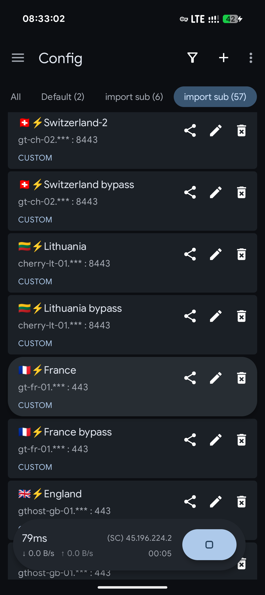
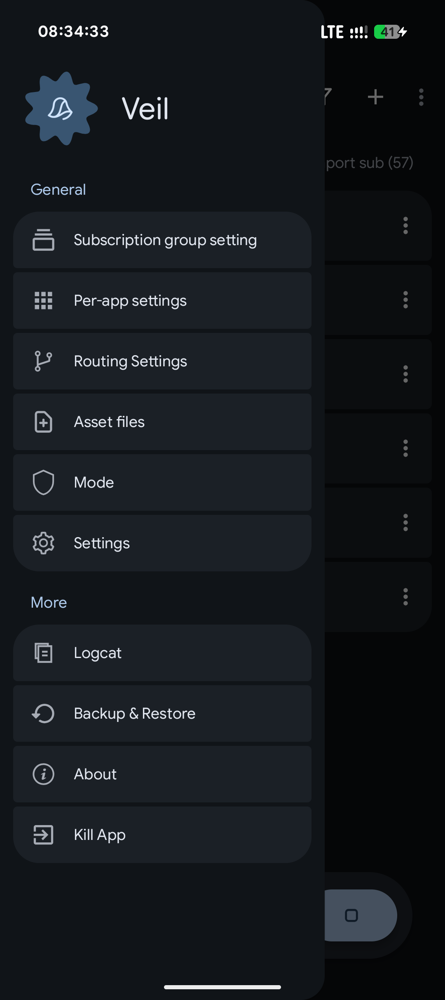
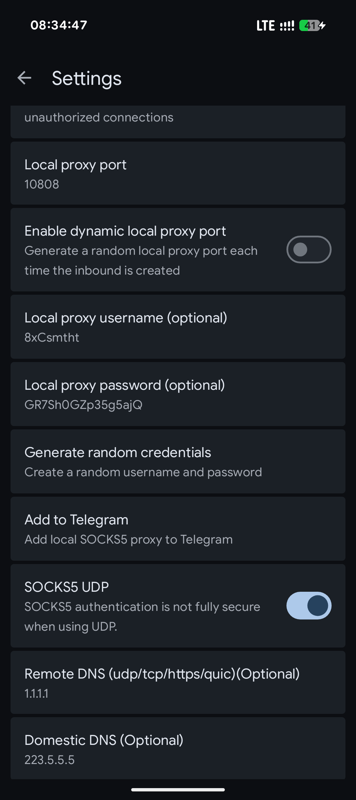

### Veil

**Xray client for Android** — Material 3, with olcRTC and OpenFlux transports.

 

  
  
  

  <a href="https://github.com/venterum/veil/releases"><b>Download APK</b></a>
  &nbsp;&middot;&nbsp;
  <a href="https://apps.obtainium.imranr.dev/redirect.html?r=obtainium://add/https://github.com/venterum/veil">Obtainium</a>
  &nbsp;&middot;&nbsp;
  <a href="#screenshots">Screenshots</a>
  &nbsp;&middot;&nbsp;
  <a href="docs/index.md">Docs</a>

---

> **Beta software** — early development, breaking changes expected. Please [report issues](https://github.com/venterum/veil/issues).

An Xray client for Android with the standard V2Ray/Xray protocols plus two pluggable transports: **olcRTC** and **OpenFlux**. Config-compatible with [v2rayNG](https://github.com/2dust/v2rayNG).

---

## Screenshots

  <kbd>
    
     
    <b>Home</b>
  </kbd>
  &nbsp;&nbsp;
  <kbd>
    
     
    <b>Panel</b>
  </kbd>
  &nbsp;&nbsp;
  <kbd>
    
     
    <b>Settings</b>
  </kbd>

---

## Features

- **Protocols:** VMess, VLESS, Shadowsocks, Trojan, SOCKS, WireGuard, Hysteria2
- **olcRTC:** Jitsi / Telemost / WbStream carriers; DataChannel / VP8 / SEI transports
- **OpenFlux:** Yandex Docs / MAX / Cups.online transports; requires a self-hosted exit node
- **Modes:** VPN (TUN), proxy-only (SOCKS5), hybrid (SOCKS5 with an in-app TUN toggle), root
- **Proxy chains:** route through multiple servers
- **Routing:** one-tap presets (Bypass RU / CN / IR), block ads, per-app proxy, custom rules, GeoIP / Geosite asset downloads
- **Other:** subscriptions, QR import / export, fragmentation, mux, split-tunneling, home-screen widget

---

## Documentation

[Architecture](docs/en/architecture.md) · [Building](docs/en/build.md) · [olcRTC](docs/en/olcrtc.md) — **EN** / **RU** in [docs](docs/index.md).

---

## Legal

For lawful use only. You are responsible for complying with the laws of your jurisdiction and for the servers you choose to use. The author does not endorse or encourage illegal activity.

---

## Credits

| Project | Role |
|---|---|
| [Xray-core](https://github.com/XTLS/Xray-core) / [v2ray-core](https://github.com/v2fly/v2ray-core) | Core engine |
| [hev-socks5-tunnel](https://github.com/heiher/hev-socks5-tunnel) | TUN → SOCKS5 |
| [olcRTC](https://github.com/openlibrecommunity/olcrtc) | WebRTC transport |
| [OpenFlux](https://github.com/p1neappleXpress/OpenFlux) | Pluggable-transport tunnel |
| [v2rayNG](https://github.com/2dust/v2rayNG) | Upstream base |
| [Google Sans](https://fonts.google.com/specimen/Google+Sans) | Typeface (SIL OFL 1.1) |

---

## License

[GNU General Public License v3.0](LICENSE).
